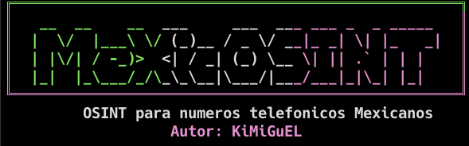

<p align="center">
  
</p>

<p align="center">
  
  
  
  
  
  
</p>

<h1 align="center">MeXiCOSINT</h1>

<p align="center">
  Herramienta OSINT enfocada en análisis, validación, enriquecimiento y reportes de números telefónicos mexicanos.
</p>

---

## Descripción

**MeXiCOSINT** es una herramienta de OSINT desarrollada en Python y enfocada en números telefónicos mexicanos.

La herramienta puede validar números, analizar formatos mexicanos, consultar fuentes opcionales mediante API, procesar metadatos disponibles y generar resultados útiles para investigación autorizada.

> Este proyecto está en fase beta. Los resultados deben tratarse como indicadores OSINT, no como evidencia absoluta.

---

## Características

- Validación de números telefónicos mexicanos
- Formato nacional e internacional
- Análisis local de números mexicanos
- Enriquecimiento opcional mediante APIs externas
- Procesamiento relacionado con IFT/SNS
- Soporte para módulo QuienHabla.mx
- Escaneo combinado número + IP en una sola corrida
- Gestión de API keys desde la CLI (`--set-key`, `--list-keys`, `--config-path`)
- Configuración local de API keys
- Soporte para reportes o salidas generadas según la versión

---

## Estructura del repositorio

```text
MeXiCOSINT/
├── bin/
│   └── mexicosint
├── docs/
│   ├── INSTALL.md
│   ├── USAGE.md
│   └── CONFIG.md
├── src/
│   └── mexicosint/
│       ├── __init__.py
│       ├── __main__.py
│       ├── cli.py
│       ├── main.py
│       ├── data/
│       ├── modules/
│       │   ├── ift_sns.py
│       │   ├── local_parser.py
│       │   └── quienhabla.py
│       ├── services/
│       │   ├── ip_geo.py
│       │   └── scanner.py
│       └── utils/
│           └── validation.py
├── pyproject.toml
├── requirements.txt
├── .gitignore
├── LICENSE
└── README.md
```

---

## Instalación

### Opción 1: pipx (recomendada)

MeXiCOSINT está publicado en PyPI. La forma recomendada de instalarlo es con `pipx`, que instala el comando de forma global pero aislada, sin tocar el Python del sistema (importante en Kali Linux moderno, donde `pip install` global está bloqueado por PEP 668):

```bash
sudo apt install -y pipx
pipx install mexicosint
```

Después solo ejecuta:

```bash
mexicosint
```

Para actualizar a una nueva versión:

```bash
pipx upgrade mexicosint
```

### Opción 2: pip directo

Si prefieres pip (fuera de Kali, o usando `--break-system-packages` en Kali):

```bash
pip install mexicosint
```

### Opción 3: clonar el repositorio

Útil si quieres modificar el código o colaborar:

```bash
git clone https://github.com/KiMiGuel/MeXiCOSINT.git
cd MeXiCOSINT
python3 -m venv venv
source venv/bin/activate
pip install -r requirements.txt
pip install -e .
```

---

## Uso

Ejecuta MeXiCOSINT usando el comando:

```bash
mexicosint 5512345678
mexicosint -b 5512345678
```

Escaneo combinado número + IP (el orden no importa):

```bash
mexicosint 5512345678 --ip 8.8.8.8
mexicosint --ip 8.8.8.8 5512345678
```

Gestión de API keys desde la CLI:

```bash
mexicosint --set-key opencage TU_KEY
mexicosint --list-keys
mexicosint --config-path
```

Si clonaste el repositorio, también puedes usar el launcher sin instalar el comando global:

```bash
bash bin/mexicosint 5512345678
```

O ejecutar el módulo del paquete:

```bash
PYTHONPATH=src python3 -m mexicosint 5512345678
```

Use `-b`, `--compact-banner`, or the legacy `--small-banner` flag to force the compact ASCII banner.

---

## Documentación

| Guía | Descripción |
|---|---|
| [Guía de instalación](docs/INSTALL.md) | Instrucciones de instalación para Kali, Debian, Ubuntu y sistemas similares |
| [Guía de uso](docs/USAGE.md) | Uso básico y notas de ejecución |
| [Guía de configuración](docs/CONFIG.md) | Configuración local y manejo de API keys |
| [English documentation](docs/ENGLISH.md) | Full documentation in English |

---

## APIs opcionales

Algunas funciones pueden depender de API keys externas.

| Servicio | Función |
|---|---|
| AbstractAPI | Validación y enriquecimiento de números telefónicos |
| NumVerify | Validación secundaria de números |
| Shodan | Enriquecimiento opcional relacionado con servicios expuestos |
| IPInfo | Enriquecimiento de metadatos IP |
| IP2Location | Enriquecimiento de metadatos IP |
| OpenCage | Geocodificación y soporte para mapas |

Las API keys deben mantenerse en tu entorno local. No las subas a GitHub.

---

## Seguridad

No subas archivos como:

```text
.env
*.env
config.json
secrets.json
keys.json
.mx_osint_config.json
```

Ruta local recomendada para configuración:

```text
~/.mx_osint_config.json
```

Permisos recomendados:

```bash
chmod 600 ~/.mx_osint_config.json
```

---

## Advertencia

**MeXiCOSINT** está diseñado para investigación autorizada, autoauditoría y flujos educativos de OSINT.

No uses esta herramienta para acoso, doxxing, fraude, amenazas o actividades no autorizadas.

La herramienta no garantiza identidad, ubicación exacta, propiedad ni atribución definitiva de un número telefónico.

---

## Estado del proyecto

Este proyecto está en desarrollo activo.

Funciones planeadas:

- Publicación de releases en GitHub
- Paquete `.deb` para instalación local con `apt`
- Mejoras en documentación
- Más pruebas y validaciones internas

---

## Licencia

Este proyecto se publica bajo la licencia incluida en este repositorio.
