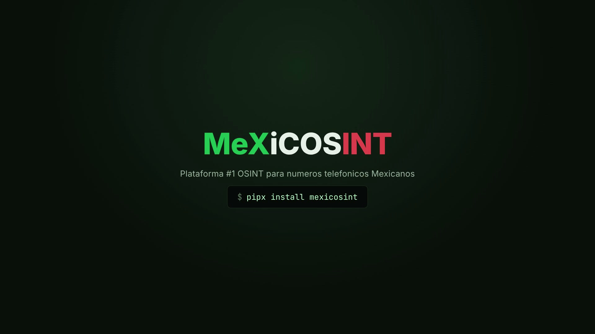

<p align="center">
  
</p>

<p align="center">
  
  
  
  
  
  
</p>

<h1 align="center">MeXiCOSINT 📞🔍</h1>

<p align="center">
  Herramienta OSINT enfocada en análisis, validación, enriquecimiento y reportes de números telefónicos mexicanos.
</p>

---

<p align="center">
  <a href="https://github.com/KiMiGuel/MeXiCOSINT/blob/main/docs/brag.mp4">
    
  </a>
  <br>
  <sub>▶️ Click la imagen para ver el video</sub>
</p>

---

## Descripción 🧭

**MeXiCOSINT** es una herramienta de OSINT desarrollada en Python y enfocada en números telefónicos mexicanos.

La herramienta puede validar números, analizar formatos mexicanos, consultar fuentes opcionales mediante API, procesar metadatos disponibles y generar resultados útiles para investigación autor[...]

> Este proyecto está en fase beta. Los resultados deben tratarse como indicadores OSINT, no como evidencia absoluta.

---

## Características ✨

- Validación de números telefónicos mexicanos
- Formato nacional e internacional
- Análisis local de números mexicanos
- Enriquecimiento opcional mediante APIs externas
- Procesamiento relacionado con IFT/SNS
- Soporte para módulo QuienHabla.mx
- **Base oficial IFT/PNN integrada**: 177k+ bloques de numeración asignada, consulta offline
- Operadora, modalidad y fecha de asignación directo del regulador
- Localidad canónica IFT/LADA: bloque IFT exacto como fuente primaria y LADA como respaldo o apoyo
- Series no geográficas 200/300/500/800/900 con alerta de números premium (900)
- Gestión de API keys desde la CLI (`--set-key`, `--list-keys`, `--config-path`)
- Configuración local de API keys
- **Rendimiento concurrente (v2.5.3)**: llamadas a APIs en paralelo (asyncio + aiohttp), pooling de conexiones HTTPS y memoización de normalización y geocodificación
- Soporte para reportes o salidas generadas según la versión
- Modo telefónico únicamente: sin proveedores IP ni escaneo IP

---

## Estructura del repositorio 📂

```text
MeXiCOSINT/
├── bin/
│   └── mexicosint
├── docs/
│   ├── INSTALL.md
│   ├── USAGE.md
│   ├── CONFIG.md
│   ├── ENGLISH.md
│   └── index.html
├── src/
│   └── mexicosint/
│       ├── __init__.py
│       ├── __main__.py
│       ├── cli.py
│       ├── config.py
│       ├── evidence.py
│       ├── main.py
│       ├── microvault_bridge.py
│       ├── numbering.py
│       ├── core/
│       │   └── models.py
│       ├── data/
│       │   ├── lada.py
│       │   ├── ift_blocks.csv.gz
│       │   └── ift_ng_blocks.csv.gz
│       ├── modules/
│       │   ├── ift_blocks.py
│       │   └── local_parser.py
│       ├── providers/
│       │   ├── base.py
│       │   ├── geoapify.py
│       │   ├── ipqualityscore.py
│       │   ├── models.py
│       │   └── opencage.py
│       └── services/
│           └── scanner.py
├── tools/
│   └── update_ift_blocks.py
├── pyproject.toml
├── requirements.txt
├── .gitignore
├── LICENSE
└── README.md
```

---

## Instalación ⚙️

### Opción 1: pipx (recomendada)

MeXiCOSINT está publicado en PyPI. La forma recomendada de instalarlo es con `pipx`, que instala el comando de forma global pero aislada, sin tocar el Python del sistema (importante en Kali Linux[...]

```bash
sudo apt install -y pipx
pipx install mexicosint
```

Después solo ejecuta:

```bash
mexicosint
```

Para actualizar a una nueva versión:

```bash
pipx upgrade mexicosint
```

### Opción 2: pip directo

Si prefieres pip (fuera de Kali, o usando `--break-system-packages` en Kali):

```bash
pip install mexicosint
```

### Opción 3: clonar el repositorio

Útil si quieres modificar el código o colaborar:

```bash
git clone https://github.com/KiMiGuel/MeXiCOSINT.git
cd MeXiCOSINT
python3 -m venv venv
source venv/bin/activate
pip install -r requirements.txt
pip install -e .
```

### Actualizar la base IFT (opcional)

El paquete ya incluye la base. Para actualizarla con el plan vigente del IFT:

```bash
python3 tools/update_ift_blocks.py
```

---

## Uso ▶️

Ejecuta MeXiCOSINT usando el comando:

```bash
mexicosint 5512345678
mexicosint +525512345678
mexicosint --microvault 5512345678
```

Gestión de API keys desde la CLI:

```bash
mexicosint --set-key opencage TU_KEY
mexicosint --set-key geoapify TU_KEY
mexicosint --set-key ipqualityscore TU_KEY
mexicosint --set-key abstract TU_KEY
mexicosint --set-key numverify TU_KEY
mexicosint --list-keys
mexicosint --config-path
```

Si clonaste el repositorio, también puedes usar el launcher sin instalar el comando global:

```bash
bash bin/mexicosint 5512345678
```

O ejecutar el módulo del paquete:

```bash
PYTHONPATH=src python3 -m mexicosint 5512345678
```

Usa `--dummy-test` para datos de prueba sin llamadas reales a APIs, y `--microvault` para leer las API keys desde un vault cifrado de MicroVault.

---

## Documentación 📚

| Guía | Descripción |
|---|---|
| [Guía de instalación](docs/INSTALL.md) | Instrucciones de instalación para Kali, Debian, Ubuntu y sistemas similares |
| [Guía de uso](docs/USAGE.md) | Uso completo: opciones, ejemplos, base IFT, API keys |
| [Guía de configuración](docs/CONFIG.md) | Configuración local y manejo de API keys |
| [Documentación en inglés](docs/ENGLISH.md) | Documentación completa en inglés |

---

## APIs opcionales 🔗

Algunas funciones pueden depender de API keys externas.

| Servicio | Función |
|---|---|
| AbstractAPI | Validación y enriquecimiento telefónico como evidencia de apoyo |
| NumVerify | Validación secundaria como evidencia de apoyo |
| OpenCage | Geocodificación primaria opcional de localidad IFT/LADA |
| Geoapify | Geocodificación fallback opcional de localidad IFT/LADA |
| IPQualityScore | Validación, reputación y abuso telefónico como evidencia de apoyo |

Formatos aceptados: `+526634647308`, `526634647308`, `6634647308`, `+52 663 464 7308`, `52-663-464-7308`, `(663) 464-7308`.

La localidad se arma desde IFT/LADA como `<ciudad o municipio>, <estado>, Mexico`. Los valores vagos de APIs externas, como país, región o etiquetas genéricas, no se geocodifican ni reemplazan[...]

Los proveedores se usan automáticamente cuando su key existe; si falta una key, esa fuente se omite sin detener el análisis. `--dummy-test` usa fixtures y no realiza llamadas reales a APIs.

Las API keys deben mantenerse en tu entorno local. No las subas a GitHub.

---

## Seguridad 🔒

No subas archivos como:

```text
.env
*.env
config.json
secrets.json
keys.json
.mx_osint_config.json
```

Ruta local recomendada para configuración:

```text
~/.mx_osint_config.json
```

Permisos recomendados:

```bash
chmod 600 ~/.mx_osint_config.json
```

---

## Advertencia ⚠️

**MeXiCOSINT** está diseñado para investigación autorizada, autoauditoría y flujos educativos de OSINT.

No uses esta herramienta para acoso, doxxing, fraude, amenazas o actividades no autorizadas.

La herramienta no garantiza identidad, ubicación exacta, propiedad ni atribución definitiva de un número telefónico.

---

## Portense bien cabrones. 🚧

---

## Licencia 📜

Este proyecto se publica bajo la licencia incluida en este repositorio.

---

## ¿Tienes MicroVault? 🔐

[MicroVault](https://github.com/KiMiGuel/MicroVault) es una bóveda local y cifrada para tus API keys: un solo archivo, una sola contraseña maestra, sin nube ni cuentas. Tus keys se guardan cifradas en disco y solo se descifran cuando las necesitas.

Si ya usas MicroVault, MeXiCOSINT puede leer tus keys directamente desde la bóveda cifrada — sin necesidad del archivo JSON. Y si **no** tienes MicroVault, no te preocupes: MeXiCOSINT sigue funcionando normalmente con el archivo JSON (`~/.mx_osint_config.json`) o con variables de entorno.

### Cómo usarlo

Hay dos formas. Elige una.

**Opción A — cargar las keys una vez por terminal (recomendada):**

1. Desbloquea la bóveda en tu terminal (pide tu contraseña maestra una sola vez):
   ```bash
   eval "$(microvault env)"
   ```
2. Ejecuta MeXiCOSINT con normalidad:
   ```bash
   mexicosint 5512345678
   ```
   Las keys quedan disponibles en ese terminal hasta que lo cierres.

**Opción B — pedir la contraseña en cada búsqueda:**

```bash
mexicosint --microvault 5512345678
```

MeXiCOSINT se conecta a MicroVault, pide tu contraseña maestra y usa las keys de la bóveda para esa búsqueda.

### Nombres de las keys

MeXiCOSINT busca estas keys dentro de tu bóveda:

| Key en MicroVault | Para qué se usa |
|---|---|
| `geoapify` | Geocodificación de respaldo |
| `opencage_api` | Geocodificación primaria |
| `ipgs` | Reputación y abuso telefónico |
| `numverify_api` | Validación secundaria |
| `abstract_api` | Enriquecimiento telefónico |

Si tu bóveda usa otros nombres, puedes ajustarlos en `src/mexicosint/config.py` (variable `MICROVAULT_SERVICES`) o crear un alias en MicroVault con el comando `microvault alias`.

### Orden de resolución de keys

MeXiCOSINT busca tus API keys en este orden:

1. **Variables de entorno** — `MEXICOSINT_GEOAPIFY_API_KEY`, `GEOAPIFY_API_KEY`, etc.
2. **MicroVault** — bóveda cifrada en `~/.microvault/vault.enc`
3. **Archivo JSON** — `~/.mx_osint_config.json` (opcional)

Si tus keys están en MicroVault o en variables de entorno, el archivo JSON no se crea ni se necesita.
